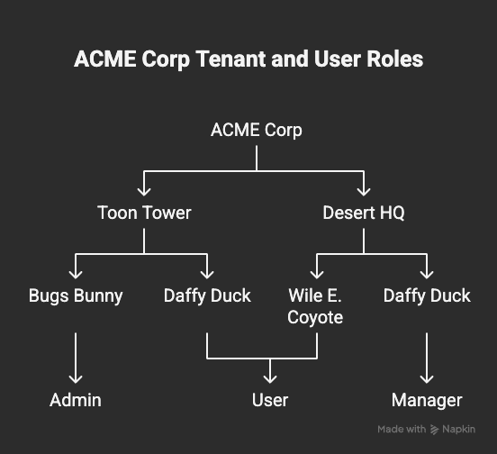

# Frontegg MCP Integration Sample

[](https://nodejs.org/)
[](https://www.npmjs.com/package/@frontegg/frontegg-mcp-server)


A demo showing how to wire up the [Frontegg MCP Server](https://github.com/frontegg/frontegg-mcp-server) with CursorAI for managing your CIAM using prompts.

## Table of Contents
- [Prerequisites](#prerequisites)
- [Installation](#installation)
- [Configuration](#configuration)
- [Enabling MCP in Cursor](#enabling-mcp-in-cursor)
- [Usage](#usage)
- [Advanced Examples](#advanced-examples)
  - [Multi-Tenant Architecture](#multi-tenant-architecture)
- [Features](#features)
  - [Available Tools](#available-tools)
    - [Roles Management](#roles-management)
    - [Permissions Management](#permissions-management)
    - [User Management](#user-management)
    - [Application Management](#application-management)
    - [Tenant Management](#tenant-management)
    - [Token Management](#token-management)
    - [Vendor Integration](#vendor-integration)
- [Troubleshooting](#troubleshooting)

## Prerequisites

- Node.js ≥14.x
- npm (or yarn)
- A Frontegg account with a Client ID & API Key
- Cursor IDE installed

## Installation

1. Clone the repo:
   ```bash
   git clone https://github.com/fxcircus/frontegg-mcp-sample.git
   cd frontegg-mcp-sample
   ```

2. Install dependencies:
   ```bash
   npm install
   ```

## Configuration

1. Create the `.cursor` directory and MCP configuration file (if they don't exist already):
   ```bash
   mkdir -p .cursor && touch .cursor/mcp.json
   ```

2. Add the following configuration to `.cursor/mcp.json` (replace with your Frontegg credentials):
   ```json
   {
       "mcpServers": {
         "frontegg": {
           "command": "node",
           "args": ["./node_modules/@frontegg/frontegg-mcp-server/build/index.js"],
           "env": {
             "FRONTEGG_CLIENT_ID": "your_client_id_here",
             "FRONTEGG_API_KEY": "your_api_key_here"
           }
         }
       }
     }
   ```

3. Save the file.

## Enabling MCP in Cursor

1. Open Cursor settings from the ⚙️ icon ➜ click on `MCP` ➜ Enable the MCP server agent.

2. Close all Cursor windows completely and re-open them.

3. Open Cursor AI chat (`⌥ + ⌘ + B`), select the Frontegg agent from the dropdown.

## Usage

Once you've set up the integration, you can query your Frontegg account directly from Cursor AI. Here are some examples:

> **Note:** You can find more useful prompt examples in the [sample_prompts.txt](sample_prompts.txt) file included in this repository.

```bash
# 1. Get all applications in your Frontegg account
> get roles

# Response:
[
  {
    "id": "xxxxxxxx-xxxx-xxxx-xxxx-xxxxxxxxxxxx",
    "vendorId": "xxxxxxxx-xxxx-xxxx-xxxx-xxxxxxxxxxxx",
    "key": "ReadOnly",
    "name": "Read Only",
    "isDefault": false,
    "firstUserRole": false,
    "createdAt": "2025-05-19T19:46:03.000Z",
    "updatedAt": "2025-05-19T19:46:03.000Z",
    "permissions": [
      "xxxxxxxx-xxxx-xxxx-xxxx-xxxxxxxxxxxx",
      "xxxxxxxx-xxxx-xxxx-xxxx-xxxxxxxxxxxx"
    ],
    "level": 0
  },
  {
    "id": "xxxxxxxx-xxxx-xxxx-xxxx-xxxxxxxxxxxx",
    "vendorId": "xxxxxxxx-xxxx-xxxx-xxxx-xxxxxxxxxxxx",
    "key": "Admin",
    "name": "Admin",
    "isDefault": true,
    "firstUserRole": false,
    "createdAt": "2025-05-19T19:46:03.000Z",
    "updatedAt": "2025-05-19T19:46:03.000Z",
    "permissions": [
      "xxxxxxxx-xxxx-xxxx-xxxx-xxxxxxxxxxxx",
      "xxxxxxxx-xxxx-xxxx-xxxx-xxxxxxxxxxxx",
      "xxxxxxxx-xxxx-xxxx-xxxx-xxxxxxxxxxxx"
    ],
    "level": 0
  }
]

# 2. Create a new role
Create role named "MyRole" with description "Custom role with Frontegg MCP"

# Response:
I've successfully created a new role:
Name: MyRole
Key: MyRole
Description: Custom role with Frontegg MCP
Level: 1
The role has been added to your Frontegg account. You can now assign permissions to this role or assign it to users as needed.
```

## Advanced Examples

### Multi-Tenant Architecture

You can create complex tenant hierarchies with users and roles by simply describing the architecture or providing a diagram. For example, you can use the prompt:

```
Here's ACME Corp's architecture. Make it real.
```

Along with a diagram like this:



The Frontegg MCP will automatically:
1. Create the parent tenant (ACME Corp)
2. Create sub-tenants (Toon Tower and Desert HQ)
3. Create any missing roles (Admin, User, Manager)
4. Create and assign users to their respective tenants with appropriate roles

This powerful feature allows you to quickly set up complex organizational structures with proper user permission hierarchies.

## Features

With this integration, you can:
- Manage Frontegg roles and permissions
- Query user information
- Perform other Frontegg administrative tasks directly from Cursor AI

### Available Tools

#### Roles Management
- Get roles
- Create role
- Delete role
- Update role
- Set permissions to role

#### Permissions Management
- Get permissions
- Create permission
- Delete permission
- Update permission
- Set permission to multiple roles
- Set permissions classification
- Get permission categories
- Create permission category
- Update permission category
- Delete permission category

#### User Management
- Get users
- Invite user
- Delete user
- Update user
- Get users for application
- Assign users to application

#### Application Management
- Get applications
- Get agent applications
- Create agent application
- Update agent application

#### Tenant Management
- Create tenant
- Delete tenant
- Update tenant

#### Token Management
- Create token
- Get tokens
- Delete token
- Get client credentials
- Create client credentials
- Update client credentials
- Delete client credentials

#### Vendor Integration
- Get vendor integrations
- Create vendor integration
- Update vendor integration
- Delete vendor integration
- Assign agents to vendor integration
- Unassign agents from vendor integration
- Get Frontegg integrations
- Get Frontegg integration

## Troubleshooting

If you encounter issues:
- Ensure your Frontegg credentials are correct
- Verify that you've restarted Cursor completely after enabling MCP
- Check that you've selected the correct agent in the Cursor AI chat dropdown 